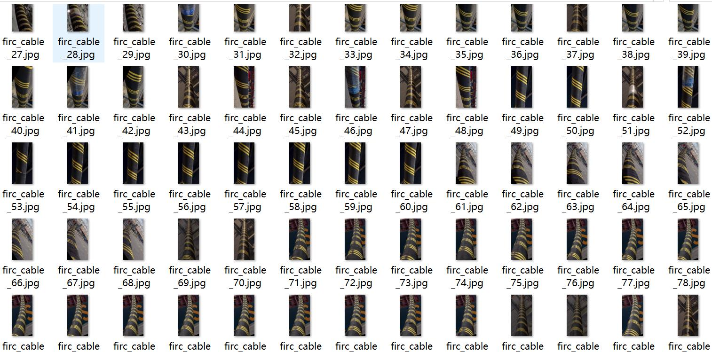
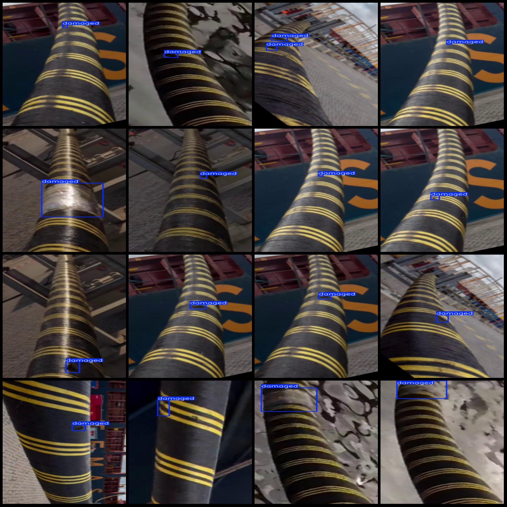
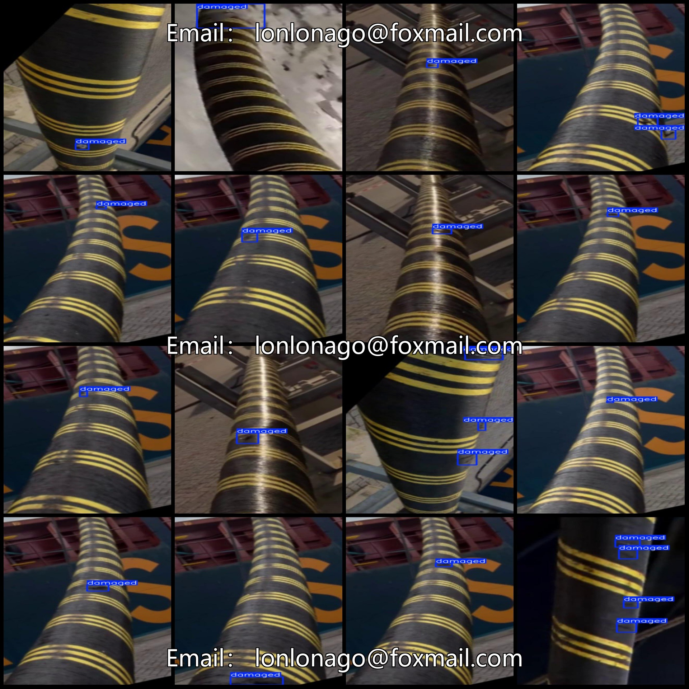

# Polymer Cable Line Surface Defect Detection Dataset in VOC+YOLO Format with 91 Categories

The dataset format: Pascal VOC format + YOLO format (without split path in the txt file, only containing jpg images along with corresponding VOC and YOLO format xml files and txt files).
Number of images (jpg file count): 91
Number of annotations (xml file count): 91
Number of annotations (txt file count): 91
Number of categories: 1
Annotation category name: ["damaged"]
Number of bounding boxes for each category:  
"damaged" bounding box count = 112
Total bounding boxes: 112
Image resolution: 320x640
Annotation tool used: labelImg
Annotation rules: Draw a square around the category
Important note: No specific instructions provided.
Special declaration: This dataset does not guarantee the accuracy of the trained model or weight files.
Image preview: 
Annotation example:

## Images

Here is a pay link on Stripe ( https://buy.stripe.com/3cs8yP7sY87d0vu9AB ). Please contact me lonlonago@foxmail.com after funding $89, and I will send you a complete data files , thank you!

